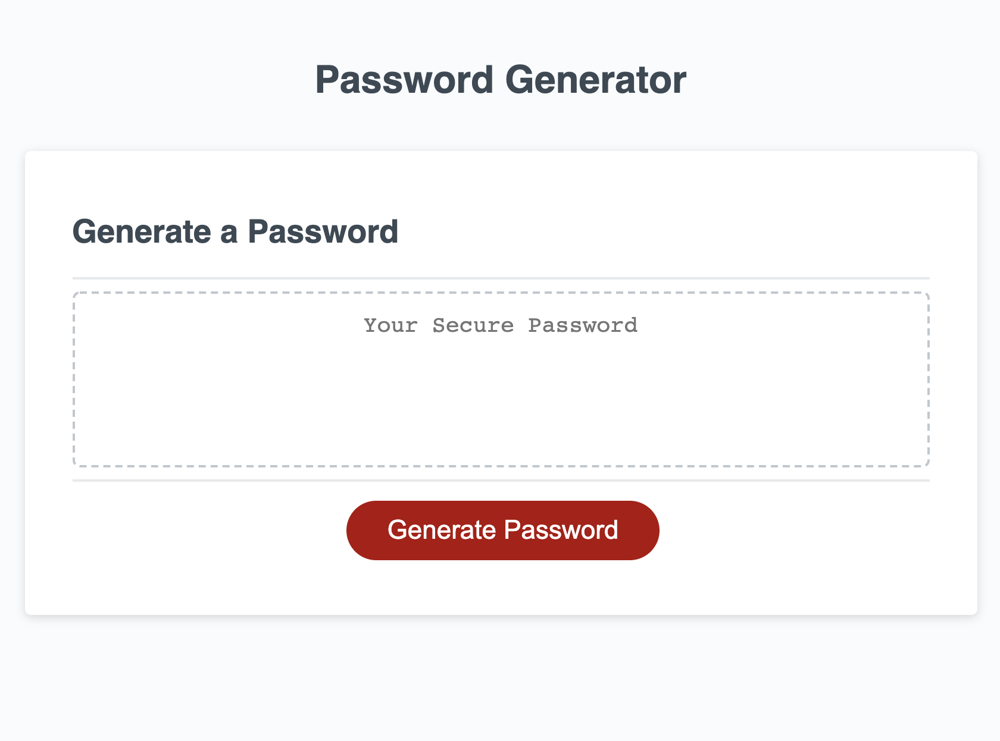
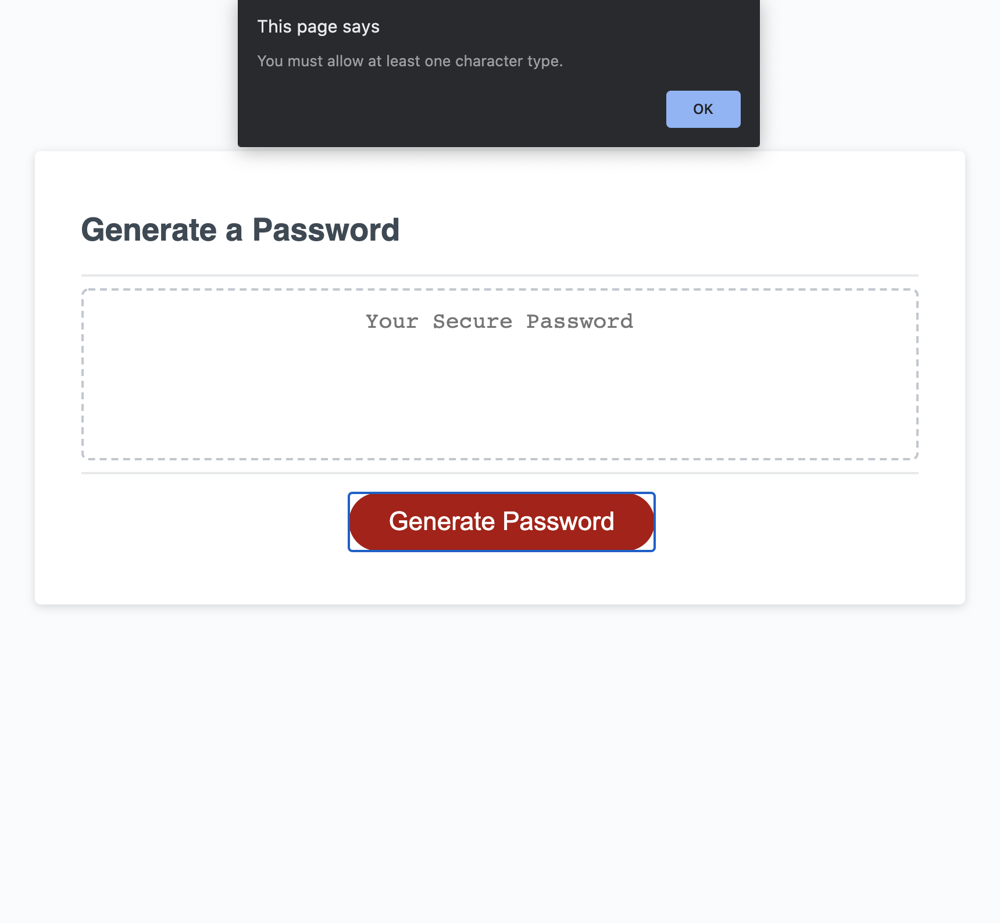
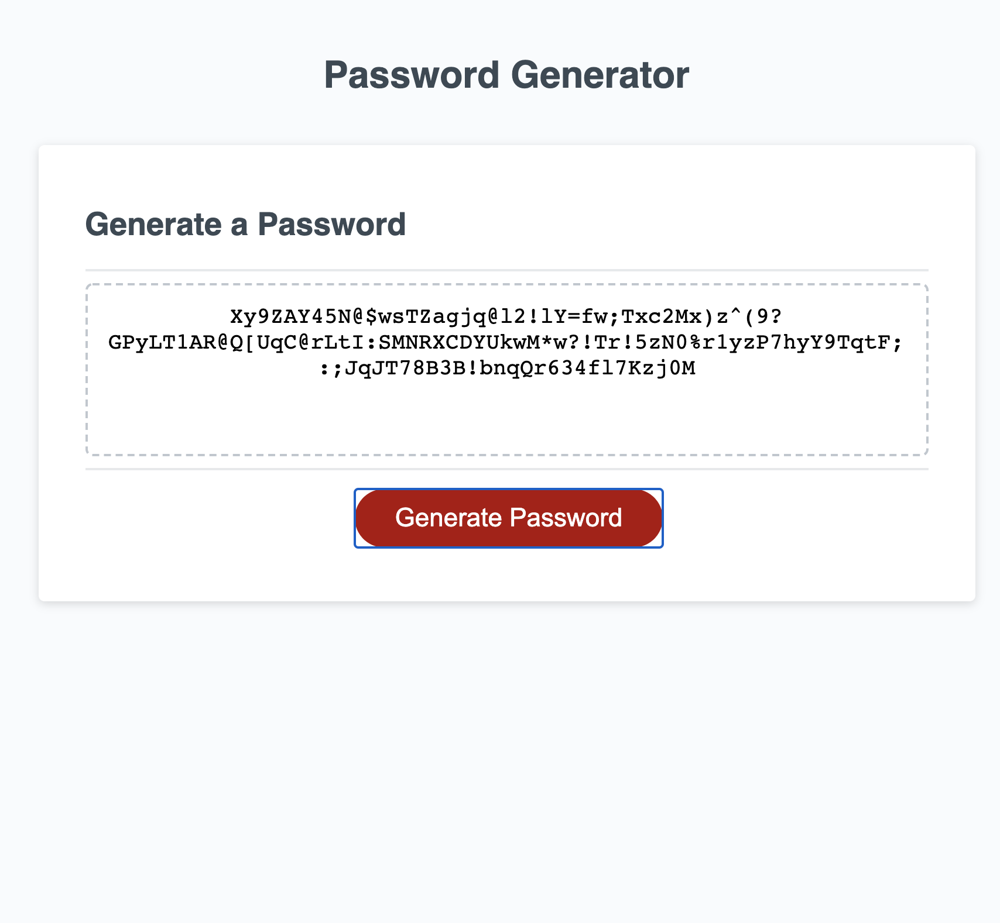

# password-generator
A web application for generating a random password with selected criteria.

This application is now live and deployed at the following URL: https://clatrobe00.github.io/password-generator/

This random password generator allows the user to select the length and types of characters included in their password, which is randomly generated after the user clicks the "Generate Password" button and selects their character and length criteria.

This application is a simple one, featuring a button to generate a password and box for it to appear in:

The application has a loop that prevents the user from selecting no criteria characters for their password:

The user can generate passwords made of upper and lower case letters, numbers, and special characters of up to 128 characters in length.

